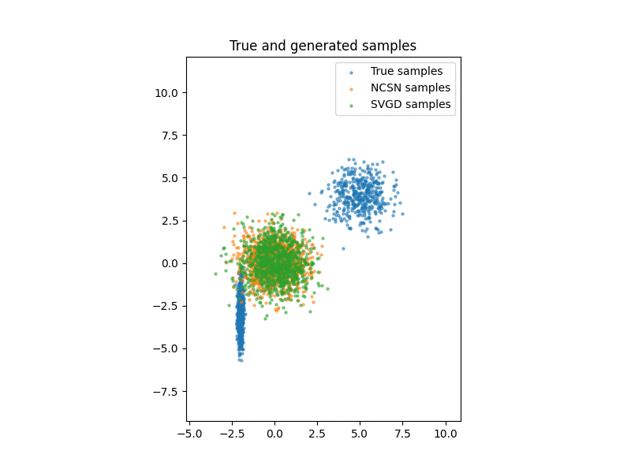
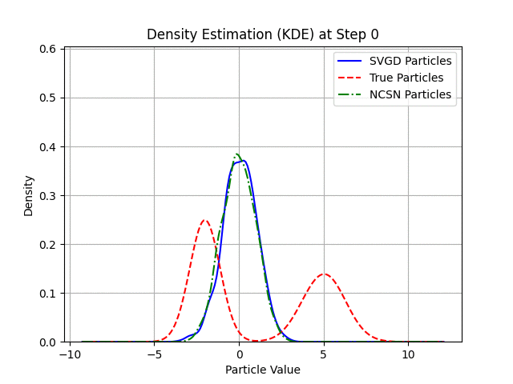

This repository provides a PyTorch implementation of Stein Variational Gradient Descent (SVGD), as described in the paper [Stein Variational Gradient Descent](https://doi.org/10.48550/arXiv.1608.04471).

Additionally, it implements the Noise Conditional Score Network (NCSN).

By running `python main.py` in the terminal, several plots illustrating the particle evolution will be generated and saved in the `Figures` folder, enabling comparisons between the methods.

  
  

